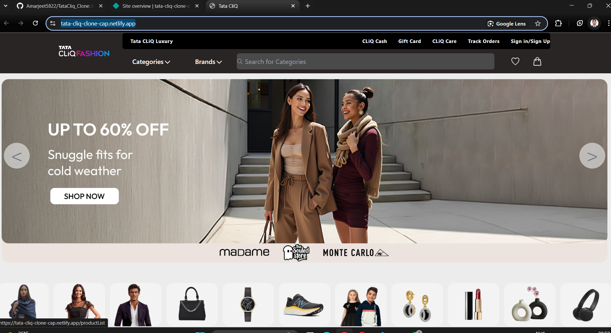

# 🛒 TataCliq Frontend Clone

This is the **frontend** clone of the TataCliq website, built during my **Construct Week**.  
It’s a fully responsive and modern e-commerce web app using **React**, styled with **Tailwind CSS**, and powered by **Redux Toolkit** for state management.

---

## 🖼️ Screenshot – Landing Page



---

## 📌 About the Project

- 👨‍💻 Built as a part of Construct Week to practice frontend skills.
- 💅 Styled completely using **Tailwind CSS** for a clean and responsive UI.
- 🧠 Managed global state using **Redux Toolkit**.
- ⚡ Fast and optimized with **Vite**.
- 🛍️ Designed to look and feel like the TataCliq website.

---

## 🔗 Live Demo

🌐 [TataCliq Live Website](https://tata-cliq-clone-cap.netlify.app)

---

## ⚙️ Installation & Usage

### 1️⃣ Prerequisites

Make sure you have the following installed:

- **Node.js** (v18 or higher recommended)  
- **npm** (comes with Node.js) or **yarn**

### 2️⃣ Clone the Repository

```bash
git clone https://github.com/Amarjeet5822/TataCliq_Clone
cd TataCliq_Clone

